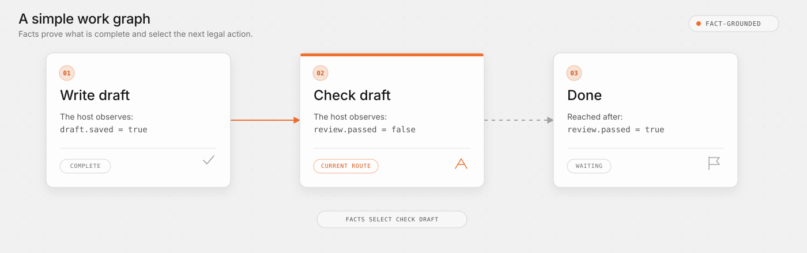
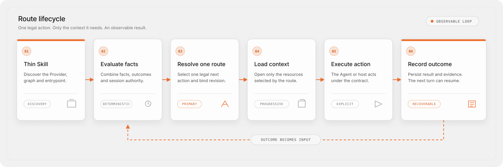
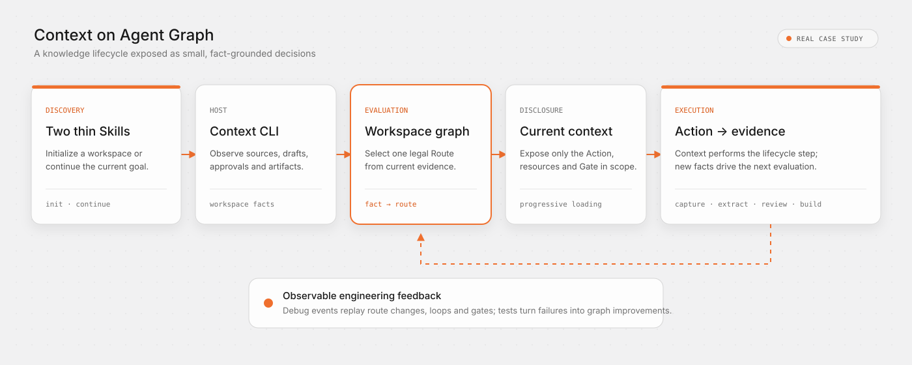

# Agent Graph

[](https://github.com/context4ai/agent-graph/actions/workflows/ci.yml)
[](https://www.npmjs.com/package/@c4a/agent-graph)
[](./package.json)
[](./LICENSE)

Agent Graph is a work-contract layer for Agent Skills. You describe a workflow as a small graph of steps; at runtime it reads the current facts and tells an Agent what to do next, which files to read for that step, and what proves the step is done. It never calls a model itself.

Agent Graph coordinates the work, not the Agents. It does not invoke models, assign Agent identities, transport shared mutable state, or schedule parallel workers. Existing Agents and hosts consume its fact-grounded Routes and hold the execution boundary.

Agents usually have enough knowledge. The harder problem is knowing which part applies now, which action is legal next, what proves that action is complete, and where to resume after an interruption. Making the prompt longer does not solve this reliably.

> Context should be discovered, not accumulated. The plan is explicit; the path is selected from current reality.

> **When to use it:** Not every Skill needs a Graph; keep a short, single-session task in `SKILL.md`. Adopt Agent Graph when a host can supply trustworthy external facts and the work truly needs verifiable completion, cross-session recovery, or testable routing and human gates.

[简体中文](./README.zh-CN.md) · [User manual](./docs/en/README.md) · [Graph Engineering](./docs/en/graph-engineering.md) · [Contributing](./CONTRIBUTING.md) · [Development](./DEVELOPMENT.md)

## A simple example

Suppose an Agent has one job: write a draft, check it, and finish.

The workflow has three steps:

```text
Write draft  →  Check draft  →  Done
```

Now assume the host can observe two facts:

```text
draft.saved   = true
review.passed = false
```

The draft already exists, but it has not passed the check. Agent Graph therefore returns **Check draft** as the current Route.



Nothing is guessed from the conversation. If `review.passed` later becomes `true`, the next evaluation reaches **Done**. If it remains `false`, the Route remains **Check draft**.

Only four ideas matter in this first example:

- **Graph** describes the legal sequence.
- **Facts** describe what is true now.
- **Route** is the next legal step selected from those Facts.
- **Action** tells the Agent or host how to perform that step.

Real workflows can add required files, human Gates, explicit Outcomes, choices, and recovery paths without changing this loop. See the [technical tutorial](./docs/en/getting-started.md) for the actual files behind a runnable example.

## What it solves

- **Large knowledge without a giant prompt.** Procedures, schemas, manuals, and generated context stay file resources, loaded only when a selected route needs them.
- **Long tasks that survive session boundaries.** Facts and explicit Outcomes reconstruct where the work is; an optional Run adds events, checkpoints, and resumable state.
- **Plans that react without drifting.** The Graph fixes the legal choices and stop conditions; current evidence decides the actual path through them.
- **Testing before model behavior.** Authors can validate references, cycles, resource boundaries, and expected routes without asking a model to run the whole workflow first.

## How it keeps work moving

The Graph records the planned boundaries—actions, dependencies, choices, gates, evidence, and recovery paths—without forcing every run through one static pipeline. Each evaluation selects a route from observable facts and prior Outcomes, and exposes only the resources that route needs:



- **runtime feedback** changes the next route: success advances the goal, missing evidence leads to verification, and failure leads to recovery or another choice;
- **engineering feedback** makes the workflow improvable: events, diagnostics, and route tests reveal problems in instructions, fact definitions, or graph structure.

Agent Graph does not silently rewrite its own plan. Runtime routing follows the evidence; the Graph itself is improved by people and engineering processes from observable results.

> Progress should be proven by facts, not remembered from conversation.

## A real-world case: Context

[Context](https://github.com/context4ai/context) uses Agent Graph beneath two thin Skills to coordinate source capture, code extraction, document structuring, review Gates, verification, and package output. Its debug recording makes every selected Route, loop, Gate, and outcome replayable.

[Watch the interactive replay](https://context4ai.github.io/agent-graph/case-studies/context/) · [Read the case study](./docs/en/case-studies/context.md)



## What the project provides

Agent Graph is a Skills-native file specification with a reference SDK and CLI:

- versioned specifications for Providers, Graphs, Actions, Resources, Runs, and tests;
- a Node.js-compatible SDK for loading and evaluating those files;
- a CLI for authoring, inspecting, testing, building, and resuming workflows;
- namespaced Skill bindings and Provider code catalogs for stable routing reasons;
- templates and importers for starting new projects or drafting from existing Skills, scripts, and dependency workflows.

It never calls a model. The CLI exposes the current legal route, required files, command plan, Gate, optional post-confirmation resolution Action, and recording contract; an Agent or host decides how to carry it out.

## How to adopt it

Agent Graph is infrastructure; installing the CLI alone does not make an existing Agent follow a workflow. An integration involves three parts: a Provider defines the work contract, a Skill makes it discoverable, and a host (your Agent or product) supplies facts, presents routes, enforces gates, and records outcomes.

Start from the situation you have:

| Your situation | Start here |
|---|---|
| Improve an existing Skill | [Migration](./docs/en/migration.md) |
| Build a new Skill or workflow | [Authoring graphs](./docs/en/authoring.md) |
| Embed routing in your own CLI, plugin, or product | [Skills and Providers](./docs/en/skills-and-providers.md) |
| Just use a capability someone already integrated | Invoke that Skill normally; you usually do not install or configure anything |

Several Skills can share one Provider, and one host can install several isolated Providers. There is no global directory, and unrelated workflows are not merged.

Install (the first form for authors, the second for an embedded host):

```bash
npm install --save-dev @c4a/agent-graph   # authoring and CI
npm install @c4a/agent-graph              # embedded SDK host
```

See the [CLI reference](./docs/en/cli.md) for exact commands, or [Getting started](./docs/en/getting-started.md) to run through it once. Node.js 20 or newer is supported.

## How a Skill connects to a graph

A host first uses `name` and `description` to decide whether a Skill matches the user's request. After the Skill is selected, three metadata fields identify the exact work graph it uses:

```markdown
---
name: draft-workflow
description: Use when a user wants to write, review, and complete a draft.
metadata:
  agent-graph: path:../../provider.yaml
  agent-graph.graph: draft
  agent-graph.entry: default
---

# Draft workflow

1. Resolve this binding and evaluate the selected Graph and Entry.
2. Resolve the current Route and read each required resource marked `read-required`.
3. Stop at any unresolved human Gate.
4. Execute only the selected Action, record an explicit Outcome, and evaluate again.
```

| Field | Purpose |
|---|---|
| `agent-graph` | Locate the Provider that contains the workflow |
| `agent-graph.graph` | Select one Graph from that Provider |
| `agent-graph.entry` | Select a public entrypoint in that Graph |

All three fields are required and validated together. `path:` always resolves relative to the current `SKILL.md`, not the process working directory. A host can instead register a shared Provider and use `provider:<id>`.

The Skill body keeps only this bootstrap and consumption contract. Phase-specific procedures, schemas, and context remain Route resources and are loaded on demand instead of being copied into the Skill. The binding selects a stable workflow; current modules, batches, and dates are runtime Facts. See [Skills and Providers](./docs/en/skills-and-providers.md) for the complete contract.

A host may attach current-conversation resource read receipts when resolving a Route. Exact static digests can then remain `current` across steps, while revision-bound dynamic views become `read-required` after the workflow revision changes. Receipts reduce repeated reading; they never prove that an Action completed.

## Documentation and reference

- [Getting started](./docs/en/getting-started.md)
- [Authoring graphs](./docs/en/authoring.md)
- [CLI reference](./docs/en/cli.md)
- [Protocol specification](./docs/en/specification.md)
- [Skills and Providers](./docs/en/skills-and-providers.md)
- [Runtime, loops, and recovery](./docs/en/runtime-and-recovery.md)
- [Testing and publishing](./docs/en/testing-and-publishing.md)
- [Migrating existing workflows](./docs/en/migration.md)
- [Adoption paths in depth](./docs/en/adoption-paths.md)
- [Graph Engineering: concept and implementation](./docs/en/graph-engineering.md)
- [Case study: Context knowledge workflows](./docs/en/case-studies/context.md)

To inspect the repository directly:

- [`examples/`](./examples) contains complete runnable scenarios; start with [`getting-started`](./examples/getting-started);
- [`schemas/`](./schemas) contains the machine-readable protocol contracts used by tools and integrations.
