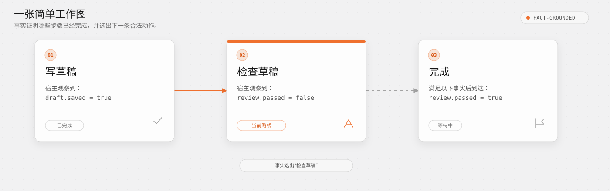
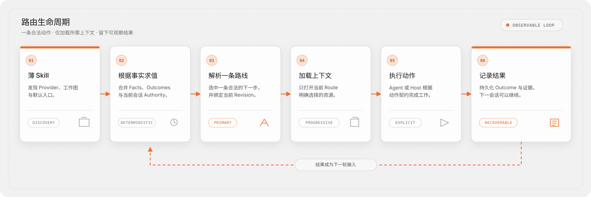

# Agent Graph

Agent Graph 是面向 Agent Skills 的工作契约层。你把一套流程写成一张步骤图，运行时它根据当前事实告诉 Agent 下一步该做什么、要读哪几个文件、怎样才算做完。它自己从不调用模型。

Agent Graph 只协调工作本身：它不调用模型，不分配 Agent 身份，不传输共享可变状态，也不调度并行 Worker。这些由已有的 Agent 和宿主完成——它们消费 Agent Graph 基于事实给出的 Route，并守住执行边界。

Agent 很多时候并不缺知识。更难的是判断：现在该读哪一部分、下一步允许做什么、什么事实能证明动作已经完成，以及会话中断后从哪里继续。把内容不断塞进更长的 Prompt，并不能可靠地解决这些问题。

> 上下文应按需发现，而不是不断堆积。计划是显式的，路径由当前现实状态决定。

> **什么时候该用：** 不是每个 Skill 都需要 Graph；单轮、短流程，靠一份 `SKILL.md` 就能完成时，保持简单。只有当宿主能提供可信的外部事实，并且任务确实需要可验证完成、跨会话恢复，或可测试的路由与人工门禁时，再引入 Agent Graph。

[English](./README.md) · [用户手册](./docs/zh-CN/README.md) · [Graph Engineering](./docs/zh-CN/graph-engineering.md) · [开发指南](./DEVELOPMENT.md)

## 先看一个最简单的例子

假设 Agent 只需要完成一件事：写一份草稿，检查草稿，然后结束。

流程只有三步：

```text
写草稿  →  检查草稿  →  完成
```

现在，宿主能够观察到两个事实：

```text
draft.saved   = true
review.passed = false
```

草稿已经保存，但还没有检查通过，所以 Agent Graph 直接把 **检查草稿** 作为当前 Route。



这里没有从对话中猜测进度。之后如果 `review.passed` 变成 `true`，下一轮求值就会到达 **完成**；如果它仍是 `false`，当前 Route 仍然是 **检查草稿**。

理解这个例子只需要四个概念：

- **Graph**：规定合法的步骤顺序。
- **Facts**：描述当前真实状态。
- **Route**：根据 Facts 选出的下一步。
- **Action**：告诉 Agent 或宿主如何执行这一步。

真实工作流可以继续加入所需文件、人工 Gate、显式 Outcome、分支和恢复路径，但基本循环不变。想查看可运行示例背后的实际文件，再进入[技术教程](./docs/zh-CN/getting-started.md)。

## 它能解决什么

- **承载大量知识而不撑大 Prompt。** Procedure、Schema、手册和动态上下文都是文件资源，选中的路线需要时才加载。
- **让长任务跨越会话。** Facts 和显式 Outcome 能重建任务进度；可选的 Run 再记录事件、Checkpoint 和可恢复状态。
- **计划随现实响应，又不至于漂移。** Graph 规定合法选择和停止条件，当前证据决定实际经过的路径。
- **运行模型之前就能测试。** 作者可以校验引用、循环、资源边界和预期路线，不必先让模型跑一遍整个流程。

## 它如何持续推进

Graph 记录既定计划的边界——动作、依赖、选择、门禁、证据和恢复路线——但不强迫每次运行都走同一条静态流水线。每一轮求值都基于可观察事实和已有 Outcome 选出一条路线，并只暴露该路线所需的资源：



- **运行反馈**改变下一条路线：成功推进目标，缺证据进入验证，失败进入恢复或另作选择；
- **工程反馈**让工作流可被改进：事件、诊断和路由测试能暴露说明、事实定义或图结构中的问题。

Agent Graph 不会在后台擅自重写自己的计划。运行时路由随证据变化，Graph 本身由人和工程流程依据可观察结果优化。

> 进展应由事实证明，而不是依赖对话记忆。

## 项目提供什么

Agent Graph 是一套 Skills 原生的文件规范，并附带参考 SDK 与 CLI：

- Provider、Graph、Action、Resource、Run 和测试用例的版本化规范；
- 兼容 Node.js、用于加载和求值这些文件的 SDK；
- 用于创建、检查、测试、构建和恢复工作流的 CLI；
- 命名空间 Skill 绑定与 Provider Code Catalog，用于稳定表达路由原因；
- 模板与导入器，用于起新项目，或把已有 Skill、脚本和依赖工作流转成草案。

它不会主动调用模型。CLI 只暴露当前合法路线、所需文件、命令计划、门禁和结果记录契约，由 Agent 或宿主决定如何完成。

## 我该怎么接入

Agent Graph 是基础设施，只装 CLI 不会让现有 Agent 自动照做。一次接入涉及三方：Provider 定义流程契约，Skill 负责被发现，宿主（你的 Agent 或产品）提供事实、展示路线、执行门禁并记录结果。

按处境对号入座：

| 你的处境 | 从这里开始 |
|---|---|
| 改进一个已有 Skill | [迁移指南](./docs/zh-CN/migration.md) |
| 从零建一个 Skill 或工作流 | [编写 Graph](./docs/zh-CN/authoring.md) |
| 把路由能力嵌进自己的 CLI、插件或产品 | [Skill 与 Provider](./docs/zh-CN/skills-and-providers.md) |
| 只是使用别人接好的能力 | 照常调用那个 Skill，通常无需自己安装或配置 |

多份 Skill 可以共享一个 Provider，一个宿主也可以安装多个互相隔离的 Provider，不需要全局目录，也不会合并无关流程。

安装（作者用前者，内嵌宿主用后者）：

```bash
npm install --save-dev @c4a/agent-graph   # 编写与 CI
npm install @c4a/agent-graph              # 内嵌 SDK 的宿主
```

需要精确命令时看 [CLI 参考](./docs/zh-CN/cli.md)，想跟着跑一遍看[快速开始](./docs/zh-CN/getting-started.md)。支持 Node.js 20 及以上版本。

## Skill 如何连接工作图

宿主先根据 `name` 和 `description` 判断一个 Skill 是否符合用户需求；Skill 被选中后，三个 metadata 字段再精确定位它使用的工作图：

```markdown
---
name: draft-workflow
description: 当用户需要撰写、检查并完成一份草稿时使用。
metadata:
  agent-graph: path:../../provider.yaml
  agent-graph.graph: draft
  agent-graph.entry: default
---

# Draft workflow

1. 解析以上绑定，并对选中的 Graph 和 Entry 求值。
2. 解析当前 Route，完整读取它要求的资源。
3. 遇到尚未解决的人工 Gate 时停止。
4. 只执行当前 Route 选择的 Action，记录显式 Outcome，再次求值。
```

| 字段 | 作用 |
|---|---|
| `agent-graph` | 定位包含工作流的 Provider |
| `agent-graph.graph` | 选择 Provider 中的一张 Graph |
| `agent-graph.entry` | 选择这张 Graph 的公开入口 |

三个字段缺一不可，并由 Loader 一次校验。`path:` 始终相对当前 `SKILL.md` 解析，而不是相对进程工作目录；宿主也可以注册共享 Provider，改用 `provider:<id>`。

Skill 正文只保留这段启动与消费规则。各阶段的操作说明、Schema 和上下文继续作为 Route 资源按需加载，不复制进 Skill。绑定只选择稳定工作流；当前模块、批次或日期属于运行时 Facts。完整规则参见 [Skill 与 Provider](./docs/zh-CN/skills-and-providers.md)。

## 文档与参考

- [快速开始](./docs/zh-CN/getting-started.md)
- [编写 Graph](./docs/zh-CN/authoring.md)
- [CLI 参考](./docs/zh-CN/cli.md)
- [协议规范](./docs/zh-CN/specification.md)
- [Skills 与 Providers](./docs/zh-CN/skills-and-providers.md)
- [运行、循环与恢复](./docs/zh-CN/runtime-and-recovery.md)
- [测试与发布](./docs/zh-CN/testing-and-publishing.md)
- [迁移已有工作流](./docs/zh-CN/migration.md)
- [接入场景详解](./docs/zh-CN/adoption-paths.md)
- [Graph Engineering：概念与实现](./docs/zh-CN/graph-engineering.md)

想直接查看仓库内容：

- [`examples/`](./examples)：可运行的完整场景，第一次阅读可以从 [`getting-started`](./examples/getting-started) 开始；
- [`schemas/`](./schemas)：供工具和集成使用的机器可读协议契约。
