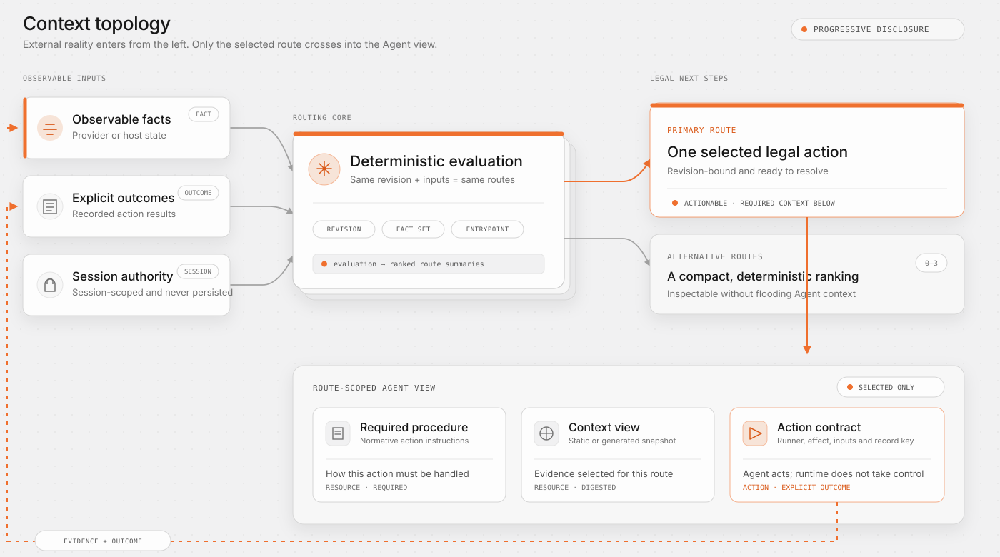

# Graph Engineering for Agent Skills

## The term and its limits

Graph Engineering is an emerging architecture label, not an official protocol, certification, or single open-source implementation. Recent writing uses it for several related ideas: networks of feedback and audit loops, durable multi-Agent organizations, and dynamically generated task graphs. Those systems differ in purpose and execution model.

Agent Graph uses the useful engineering principles behind that discussion without claiming ownership of the term or treating every Agent system as the same graph. Its narrower problem is:

> How can an Agent discover the next legal action and only the context needed for that action, while a long workflow remains observable, testable, and recoverable?

The answer is a model-free, Skills-native work-contract graph with external facts, typed outcomes, explicit gates, file resources, and an optional Run record. It coordinates work, not Agents.

## From prompt engineering to context topology

Prompt engineering improves one model interaction. Context engineering selects and shapes the information available to an interaction. Graph Engineering adds a system-level concern: how information, authority, actions, evidence, and feedback move across many interactions over time.

A complex Skill placed in one document has a flat topology: every rule is adjacent and often loaded together. The Agent must infer which phase is current and which exception matters. The workflow is difficult to test without running the whole model behavior.

Agent Graph changes the topology:



The graph does not increase the amount of context by default. It creates boundaries so the Agent can load a small, relevant slice after a route is selected.

## Reality must remain outside the optimizer

A central theme in Graph Engineering discussions is that a self-improving loop can optimize the wrong metric, corrupt its own measurement, or reinforce a local objective that harms the wider system. Multiple loops do not solve this automatically; they can simply agree with one another.

Agent Graph therefore distinguishes three things:

- **facts**: observable state supplied by a Provider or host;
- **outcomes**: explicit results of an attempted node action;
- **instructions**: procedures that explain how an Agent should act.

Instructions cannot assert facts. A `completed` Run outcome also does not defeat a node's `satisfiedBy` contract: if the required evidence is absent, the node becomes `unverified`. This is the practical role of an external anchor.

Examples include source digests, build receipts, test results, deployed versions, and review decisions with stable scope. A model summary or a second model's agreement may be useful evidence for a semantic decision, but it is not automatically a deterministic anchor.

## A graph of contracts, not a diagram of prose

Not every Skill paragraph becomes a node. Nodes are useful when something is independently actionable, gated, recoverable, repeatable, or testable. Long explanation remains a Resource.

Each graph element carries a boundary contract:

- an Action declares its runner, effect, files, and optional schemas;
- a Gate declares who must decide and whether current-session delegation is allowed;
- a node declares required facts and facts that prove satisfaction;
- an edge declares which Outcome permits a transition and what relationship it represents;
- a Resource declares whether it is a normative procedure or a generated context view;
- a Subgraph declares an explicit same-Provider control composition.

This makes static validation and route tests possible. A visual graph is then an inspection view of executable contracts, not the primary source of truth.

## Graphs of loops

Long tasks and monitoring tasks are rarely one acyclic pipeline. They include review, repair, verification, polling, re-planning, and handoff loops. The important requirement is not merely that a cycle exists, but that it has an observable continuation and stop condition.

Agent Graph uses typed Outcomes and `repeat` edges:

```text
poll --partial--> poll
poll --completed--> done
poll --failed--> recover
```

The CLI does not hide this loop in an internal daemon. Each iteration becomes a route, and each result becomes an event. A host can checkpoint, enforce budgets, wait for an external event, or hand the Run to another Agent. On resume, fact-backed conditions are evaluated again.

This is also why `partial`, `failed`, `unverified`, `skipped`, and `pending` remain separate. Erasing them would remove the feedback structure that makes a graph recoverable.

## Stable organization, dynamic work

Some Graph Engineering articles distinguish a stable organization graph from a task-specific work graph. Agent Graph v1 intentionally implements only the work-contract layer:

- Providers define trusted capabilities and resources;
- Skills expose discoverable entrances;
- Graphs define stable action categories and legal relationships;
- Routes are dynamically selected from current facts;
- Runs optionally record one execution.

Dynamic work does not require a dynamically rewritten Graph. Current targets and parameters remain Facts; stable Host Actions resolve them at execution time. This keeps the contract testable while letting each Route adapt to reality.

It does not define persistent Agent identities, communication permissions, model allocation, delegation hierarchies, or autonomous multi-Agent scheduling. A future runtime can consume the same Route contract, but those concerns should not be disguised as Graph nodes today.

It also does not move a shared state object along edges. An edge describes control and causal intent. Hosts persist artifacts outside the graph and reintroduce observable references, digests, and receipts as Facts. This keeps route evaluation deterministic and prevents implicit mutable memory from becoming the source of truth.

## Progressive disclosure is a graph property

Traditional progressive disclosure is often described as “put details in another file.” Agent Graph makes the decision structural:

1. a thin Skill gives only the bootstrap loop;
2. Evaluation returns route summaries, not every phase;
3. Route returns only resources relevant to one node;
4. static resources remain immutable files with digests;
5. dynamic context is materialized explicitly as data;
6. recommended resources are optional, while required resources are contractual.

This reduces repeated context loading and prevents a large CLI JSON response from becoming an accidental prompt. It also lets an Agent cache already-read resources by digest.

## Observability without a mandatory runtime

Many workflow frameworks own a database and durable execution engine. Agent Graph separates calculation from storage:

- Evaluation can be fully stateless when external facts are sufficient;
- a Run can record events and outcomes when needed;
- the host selects Run and Cache locations;
- Provider bundles remain read-only;
- checkpoints restore execution memory but do not replace reality checks.

This allows a repository Skill, an npm CLI, a plugin, and an enterprise product to share the same specification without forcing them into one global directory or service.

## Testability before autonomy

Agent behavior is probabilistic, but the workflow boundary does not need to be. Agent Graph tests assert routes for known states without calling a model. This provides fast coverage for:

- gate and authority behavior;
- ordering and fan-in reachability;
- partial failure and recovery;
- fact-backed completion;
- repeated work and stopping;
- Subgraph composition;
- blocked or invalid definitions.

The test suite cannot prove that an Agent will produce a good document or patch. It proves that the system exposes the intended action and context, does not bypass gates, and preserves failure states. Semantic output evaluation remains a separate layer.

## How the implementation maps to the principles

| Principle | Agent Graph implementation |
|---|---|
| External reality | restricted fact checks and `satisfiedBy` |
| Boundary contracts | strict JSON Schemas and closed object fields |
| Typed feedback | eight non-equivalent Outcomes |
| Progressive context | required/recommended file Resource locations |
| Explicit authority | Gate plus session-scoped authority input |
| Recovery | failure edges, repeat edges, Run events, checkpoint/resume |
| Explainability | deterministic Evaluation, Route, inspection, and digests |
| Stable reasons | route reason codes plus optional file-backed Code Catalog |
| Testability | declarative state-to-route cases |
| Portability | relative Provider references and host-selected stores |
| Supply-chain clarity | Action effects, reachable-file bundles, content digests |

## What v1 deliberately does not solve

- arbitrary expression evaluation;
- automatically generated or self-modifying Graph definitions;
- cross-Provider graph calls or merging;
- model invocation and multi-Agent orchestration;
- parallel or concurrent fan-out execution;
- edge-carried artifacts or shared mutable state;
- scheduling, queues, distributed locks, or durable timers;
- automatic trust in commands or third-party Skills;
- semantic proof that an Agent-created artifact is correct.

These constraints keep the first version useful as a standard and toolchain rather than turning it into another all-encompassing Agent framework.

## Sources behind the design discussion

- Carlos E. Perez, [“From Loop Engineering to Graph Engineering?”](https://x.com/IntuitMachine/article/2078419526354378975)
- AI Builder Club, [Graph Engineering Guide 2026](https://www.aibuilderclub.com/blog/graph-engineering-guide-2026)
- TrueFoundry, [Graph Engineering: Enterprise Guide](https://www.truefoundry.com/blog/graph-engineering-enterprise-guide)
- ExplainX, [Graph Engineering for AI Agents and Multi-Agent Organizations](https://explainx.ai/blog/graph-engineering-ai-agents-multi-agent-organizations-2026)

These sources advocate overlapping ideas rather than one shared wire protocol. Agent Graph's schemas and CLI are this project's concrete proposal for the Skills/workflow layer.
