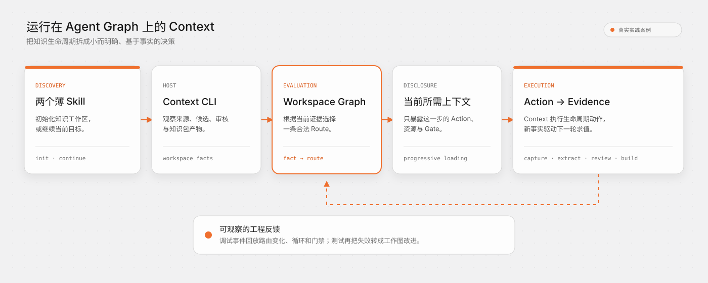

# 实践案例：Context 知识工作流

[English](../../en/case-studies/context.md) · [交互式回放](https://context4ai.github.io/agent-graph/case-studies/context/?lang=zh)

Context 是一套知识管理工具：把代码仓库和文档转成经过审核、可以归因的知识包。它的生命周期足够长，也足够真实——来源要先界定和采集，代码与文档走不同的生产路径，人工门禁可能暂停流程，批准知识还要经过关闭、验证和构建。

Context 使用 Agent Graph 承载工作契约。Agent Graph 不提取代码、不理解文档语义，也不批准知识；Context 始终是宿主，负责观察工作区事实、执行生命周期动作、约束权限并产出证据。Agent Graph 根据这些事实求值，选出下一条合法 Route。

## 两个 Skill 驱动一套完整工作流

Context 插件对外只有两个 Skill：

- `init`：创建知识工作区，并进入第一条 Route；
- `continue`：检查已有工作区，根据当前事实继续目标。

它们有意保持很薄，只负责定位 Provider、Graph 和 Entry，并告诉 Agent 如何消费 Route。各阶段的操作说明、Schema、来源视图、审核契约和知识包说明仍是独立资源；只有被当前 Route 选中的那部分才会暴露。

因此，每次调用不必把完整知识生命周期塞进 Prompt。Skill 外壳稳定、容易被发现，CLI 仍可以独立演进详细流程和资源，而不把 Skill 变成长篇手册。

## 直接检查这套接入

完整接入公开在 [`context-workflow/`](https://github.com/context4ai/context/tree/main/packages/context-cli/context-workflow)。它展示了一个薄 Skill 如何连接一套更大、又能独立测试的工作契约：

- [`provider.yaml`](https://github.com/context4ai/context/blob/main/packages/context-cli/context-workflow/provider.yaml) 绑定 `workspace` Graph、原因码目录、Action、Resource 和入口。
- [`graphs/workspace.yaml`](https://github.com/context4ai/context/blob/main/packages/context-cli/context-workflow/graphs/workspace.yaml) 是静态生命周期：32 个 Action、Gate、Terminal 节点，以及它们之间允许发生的流转。
- [`actions/`](https://github.com/context4ai/context/tree/main/packages/context-cli/context-workflow/actions) 包含 25 份可执行契约。Action 描述宿主命令、副作用、权限边界和预期结果，不承载长篇手册。
- [`resources/`](https://github.com/context4ai/context/tree/main/packages/context-cli/context-workflow/resources) 包含 57 份可寻址文件：Procedure 说明当前任务，Dialogue 解释人工决定，View 物化实时工作区事实，Semantic Reference 指导判断，Diagnostic 解释错误，Manual 记录稳定 API。
- [`codes.yaml`](https://github.com/context4ai/context/blob/main/packages/context-cli/context-workflow/codes.yaml) 用稳定状态码解释 Route 与诊断，避免把长段文字塞进日常机器输出。
- [`tests/`](https://github.com/context4ai/context/tree/main/packages/context-cli/context-workflow/tests) 直接用 Facts 验证路由，不需要启动 Agent 或模型。

`context status` 是宿主侧的事实观察边界：它检查工作区、把 Facts 交给 Agent Graph，再返回 `workflow.current`——包括选中的 Route、原因码、命令计划、Gate，以及此刻真正需要的 Resources。静态文件可以按 digest 复用读取回执；动态 View 则绑定选中它的工作流 revision。回执只证明资源已经交付，不会把外部任务冒充成已完成。

因此，两个小 Skill 可以安全承载远大于自身的操作知识。详细内容没有被删除，也没有被摘要替代，而是被分离、由 Graph 按需选择，并以可验证方式交付，不再每轮全部加载。

## 各层分别负责什么

| 层 | 在 Context 中的职责 |
|---|---|
| Skill | 能力发现，以及很小的 Route 消费契约 |
| Context 宿主 | 观察文件与外部系统、执行命令、约束权限、记录证据 |
| Provider | 绑定 `workspace` Graph、入口、Action、资源和原因码目录 |
| Graph | 描述合法生命周期状态、依赖、Gate、循环和终局 |
| Route | 只暴露当前动作、所需资源和完成契约 |
| Facts 与 Outcomes | 证明实际发生了什么；对话里的“已经完成”不算证据 |

在本案例记录时，这套接入包含 32 个 Graph 节点、11 个人工或权限 Gate、25 份 Action 描述、57 个可寻址资源和 34 条路由测试。这些数字描述的是一个实际产品接入，不是协议上限。回放页面的“工作图”按钮会把这份静态契约可视化；每一步右侧还会把当前 Action 和 Resources 链回上述真实源码。

## 一张工作图，两条知识路径

代码与文档共享一个工作区，但不会被假装成同一种流程：

1. 来源事实先确定本轮允许使用的代码模块与文档。
2. 文档采集按来源循环，直到每份来源都有可审计快照。
3. 代码提取按模块循环，完成整个批次后进入代码候选审核 Gate。
4. 文档结构规划先确认页面和章节都有连续证据。
5. 文档编译按已确认目标循环，全部完成后统一审核。
6. 最后通过确定性的 close、verify 和 build 产出消费包。

多个来源不需要复制多套 Graph。Graph 只描述“仍有来源待采集”“仍有确认结构未编译”这类稳定状态；具体是哪个来源或模块，由运行时 Facts 给出。工作图保持静态，项目和批次仍可自由变化。

## 全托管不等于绕过门禁

全托管模式可以连续执行确定性的 Route，只在需要语义判断、缺少授权、需要人工决定，或无法安全证明的修复处停止。当前会话授权可以解决符合条件的 Gate，但不会把项目永久改成全托管。

这样，机械循环和状态刷新不再反复占用 Agent 回合；真正改变语义或权限边界的决定仍然可见。

## 记录、回放，再改进工作图

Context 开启 debug 后，宿主会记录 CLI 调用边界和 Agent Graph 求值结果。回放可以观察：

- 每次事实变化后选中了哪条语义 Route；
- 多来源循环推进到了第几次；
- 哪个授权或审核 Gate 暂停了流程；
- 哪个 reason code 解释了这次流转；
- 最终如何到达知识包完成状态。

[交互式实践回放](https://context4ai.github.io/agent-graph/case-studies/context/?lang=zh)来自一次真实运行的脱敏投影。它保留路由顺序、重复求值、状态、reason code 和相对时间，但不包含来源正文、本机路径、凭证、不透明 ID 或组织相关名称。

这不只是一个展示页面。路由记录能暴露无效循环、重复资源读取、不完整的恢复路径，以及错误的状态优先级；这些观察再进入确定性路由测试和 Graph 修改，形成 Graph Engineering 的反馈闭环。

## 这个案例证明了什么

Context 并不证明每个 Skill 都需要 Graph。它证明的是：当一个 Skill 背后连接了长期、有状态、依赖外部事实、包含多种门禁和批次循环、又必须支持恢复的产品流程时，工作图开始真正产生价值。

两个 Skill 之所以可以保持很小，是因为 Graph、资源和宿主共同承担了其余职责：Agent 只看到此刻重要的内容，宿主证明实际结果，Graph 保证下一步合法并且可以测试。
