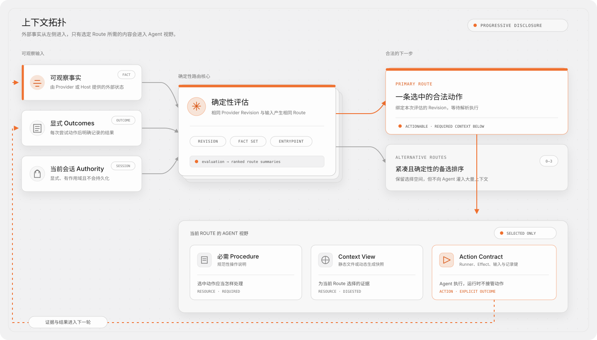

# 面向 Agent Skills 的 Graph Engineering

## 术语与边界

Graph Engineering 是一个正在形成的架构标签，不是官方协议、认证或单一开源实现。近期文章分别用它描述反馈与审计循环网络、持久多 Agent 组织，以及动态生成的任务图；这些系统的目标和执行模型并不相同。

Agent Graph 吸收其中值得落地的工程原则，但不宣称拥有这个术语，也不把所有 Agent 系统混成同一种图。它聚焦一个更窄的问题：

> 如何让 Agent 发现下一条合法动作，并只获得该动作所需上下文，同时让长工作流可观察、可测试、可恢复？

本项目的答案是：无模型、以 Skills 为入口的工作契约图，以及外部 Facts、类型化 Outcome、显式 Gate、文件资源和可选 Run 记录。它编排工作，不编排 Agent。

## 从提示词工程到上下文拓扑

Prompt Engineering 改善一次模型交互；Context Engineering 选择和组织一次交互可见的信息；Graph Engineering 进一步关注系统层关系：信息、权限、动作、证据和反馈如何跨越多次交互流动。

复杂 Skill 全部写在一个文件时，其拓扑是平的：所有规则相邻，往往一起加载；Agent 需要自行推断当前阶段和相关例外，且难以在不运行完整模型行为的情况下测试流程。

Agent Graph 改变的是拓扑：



Graph 不会默认增加上下文，而是建立边界，让 Agent 在选定 Route 后只加载很小的相关切片。

## 现实必须位于优化器之外

Graph Engineering 讨论中的核心问题之一是：自我改进循环可能优化错误指标、破坏自己的测量链，或强化损害整体系统的局部目标。增加多个循环也不会自动解决，它们可能只是彼此赞同。

因此 Agent Graph 区分三类内容：

- **Facts**：由 Provider 或宿主提供的可观察状态；
- **Outcomes**：一次节点动作尝试后的显式结果；
- **Instructions**：说明 Agent 应如何行动的 Procedure。

Instruction 不能声明 Fact。Run 中记录的 `completed` 也不能击穿节点的 `satisfiedBy` 契约：缺少所需证据时，节点会变成 `unverified`。这就是外部锚点的实际作用。

Source digest、Build receipt、测试结果、已部署版本、带稳定范围的审核决定都可以成为锚点。模型总结或第二个模型的赞同可以帮助语义决策，但不会自动成为确定性事实。

## 契约图，而不是文案图

并非每段 Skill 文案都应变成节点。只有可独立执行、受门禁、可恢复、可重复或可测试的部分才适合成为 Node；长篇解释继续作为 Resource。

每类图元素都有边界契约：

- Action 声明 Runner、Effect、文件与可选 Schema；
- Gate 声明谁必须决定，以及是否允许当前会话委托；
- Node 声明必需 Facts 和证明完成的 Facts；
- Edge 声明允许转移的 Outcome 及其关系语义；
- Resource 区分规范性 Procedure 与生成的 Context View；
- Subgraph 显式声明同 Provider 内的控制组合。

由此才能进行静态校验和 Route 测试。可视化图只是执行契约的检查视图，不是另一份事实来源。

## 循环组成的图

长任务与监控任务很少是单一无环流水线，通常包含 Review、Repair、Verify、Poll、Re-plan 和 Handoff 循环。关键不是图中“存在一个圈”，而是循环必须有可观察的继续条件和停止条件。

Agent Graph 使用类型化 Outcome 与 `repeat` Edge：

```text
poll --partial--> poll
poll --completed--> done
poll --failed--> recover
```

CLI 不会把循环隐藏在内部 Daemon 中。每轮都是一条 Route，每次结果都是 Event；宿主可以 Checkpoint、限制预算、等待外部事件或把 Run 交给另一个 Agent。恢复时会重新评估 Fact-backed 条件。

这也解释了为什么 `partial`、`failed`、`unverified`、`skipped` 和 `pending` 必须保持独立。抹掉这些状态，就抹掉了使 Graph 可恢复的反馈结构。

## 稳定组织与动态工作

一些 Graph Engineering 文章区分稳定的组织图和任务级工作图。Agent Graph v1 有意只实现工作契约层：

- Provider 定义可信能力与资源；
- Skill 暴露可发现入口；
- Graph 定义动作关系；
- Route 根据当前 Facts 动态选择；
- Run 可选地记录一次执行。

它不定义持久 Agent 身份、通信权限、模型分配、委托层级或自主多 Agent 调度。未来 Runtime 可以消费相同 Route 契约，但当前不应把这些能力伪装成普通 Graph Node。

它也不会让共享 State 对象沿 Edge 流动。Edge 描述控制与因果意图；宿主在 Graph 外持久化 Artifact，再把可观察的引用、Digest 与 Receipt 作为 Facts 引回。这使路线求值保持确定性，也避免隐式可变内存成为事实来源。

## 渐进披露是图属性

传统渐进披露常被简化成“把细节放到另一个文件”。Agent Graph 将选择过程结构化：

1. 薄 Skill 只提供 Bootstrap 循环；
2. Evaluation 返回 Route Summary，而不是所有阶段；
3. Route 只返回一个 Node 相关资源；
4. 静态 Resource 是带 Digest 的不可变文件；
5. 动态 Context 只作为数据显式物化；
6. Recommended Resource 可选，Required Resource 构成契约。

这样可减少重复加载，也避免大型 CLI JSON 意外变成长提示词。Agent 还可以按 Digest 复用已经完整读取的资源。

## 无需强制 Runtime 的可观察性

许多工作流框架拥有数据库和 Durable Execution Engine。Agent Graph 将计算与存储拆开：

- 外部 Facts 足够时，Evaluation 完全无状态；
- 需要时 Run 才记录 Events 与 Outcomes；
- 宿主选择 Run 与 Cache 的位置；
- Provider Bundle 始终只读；
- Checkpoint 恢复执行记忆，但不能替代现实检查。

因此仓库 Skill、npm CLI、Plugin 和企业产品可以共享同一规范，而不必使用同一个全局目录或服务。

## 先可测试，再谈自治

Agent 行为具有概率性，但工作流边界无需如此。Agent Graph 测试不调用模型，直接断言已知状态对应的 Route，可快速覆盖：

- Gate 与 Authority；
- 顺序与 fan-in 可达性；
- 部分失败与恢复；
- Fact-backed 完成；
- 重复工作与停止；
- Subgraph 组合；
- 阻塞与非法定义。

测试无法证明 Agent 会生成优秀文档或代码；它证明系统暴露了预期动作和上下文，不会绕过门禁，并保留失败状态。语义产物评估属于另一层。

## 工程原则如何落到实现

| 原则 | Agent Graph 实现 |
|---|---|
| 外部现实 | 受限 Fact Check 与 `satisfiedBy` |
| 边界契约 | 严格 JSON Schema 与封闭字段 |
| 类型化反馈 | 八种不可互换 Outcome |
| 渐进上下文 | Required/Recommended 文件 Resource Location |
| 显式权限 | Gate 与会话级 Authority 输入 |
| 恢复 | Failure Edge、Repeat Edge、Run Event、Checkpoint/Resume |
| 可解释 | 确定性 Evaluation、Route、Inspection 与 Digest |
| 可测试 | 声明式 State-to-Route Case |
| 可迁移 | Provider 相对引用与宿主选择 Store |
| 供应链边界 | Action Effect、可达文件 Bundle 与内容 Digest |

## v1 有意不解决的问题

- 自由表达式执行；
- 自动生成或自修改 Graph；
- 跨 Provider Graph 调用或合并；
- 模型调用和多 Agent 编排；
- 并行或并发 Fan-out 执行；
- 沿 Edge 传递 Artifact 或共享可变状态；
- 调度、队列、分布式锁或 Durable Timer；
- 自动信任命令或第三方 Skill；
- 从语义上证明 Agent 产物正确。

这些限制让首版保持为可采用的规范与工具链，而不是另一个包揽一切的 Agent Framework。

## 相关讨论来源

- Carlos E. Perez：[From Loop Engineering to Graph Engineering?](https://x.com/IntuitMachine/article/2078419526354378975)
- AI Builder Club：[Graph Engineering Guide 2026](https://www.aibuilderclub.com/blog/graph-engineering-guide-2026)
- TrueFoundry：[Graph Engineering: Enterprise Guide](https://www.truefoundry.com/blog/graph-engineering-enterprise-guide)
- ExplainX：[Graph Engineering for AI Agents and Multi-Agent Organizations](https://explainx.ai/blog/graph-engineering-ai-agents-multi-agent-organizations-2026)

这些资料倡导的是相互重叠的理念，而不是共同 Wire Protocol。Agent Graph 的 Schema 与 CLI 是本项目针对 Skills/工作流层提出的具体方案。
